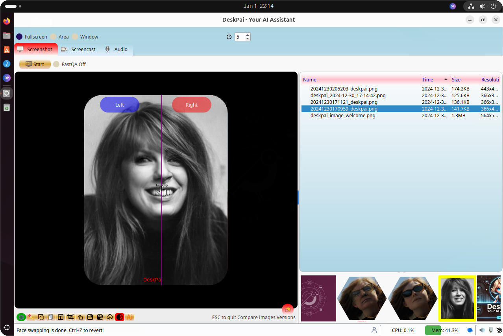
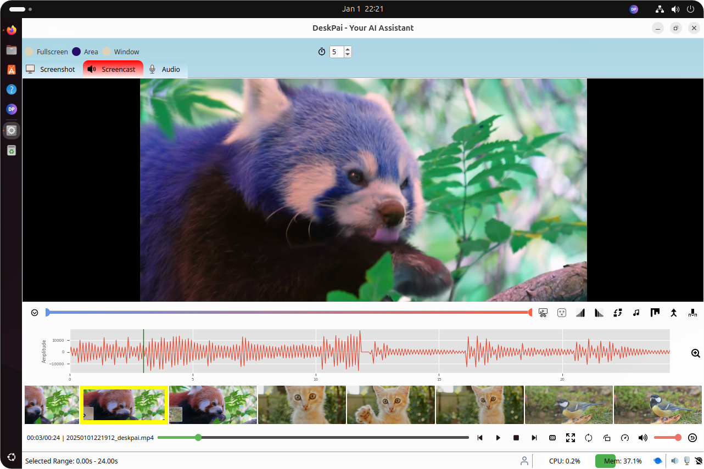
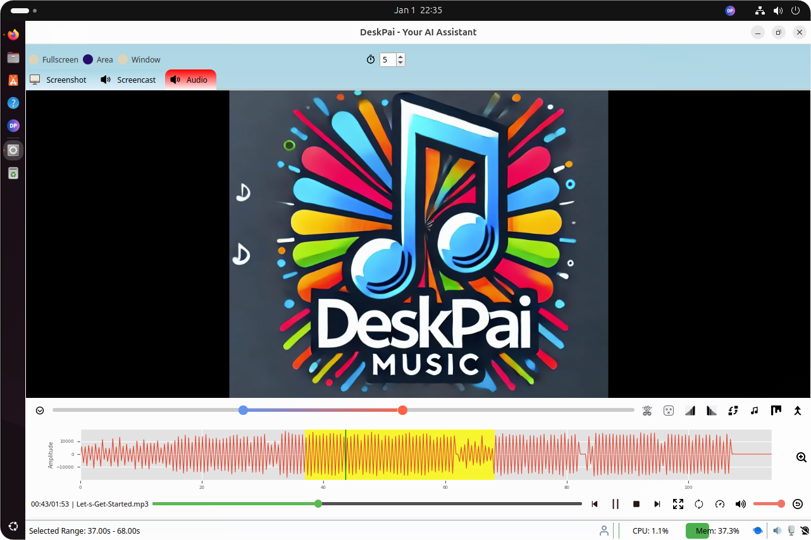
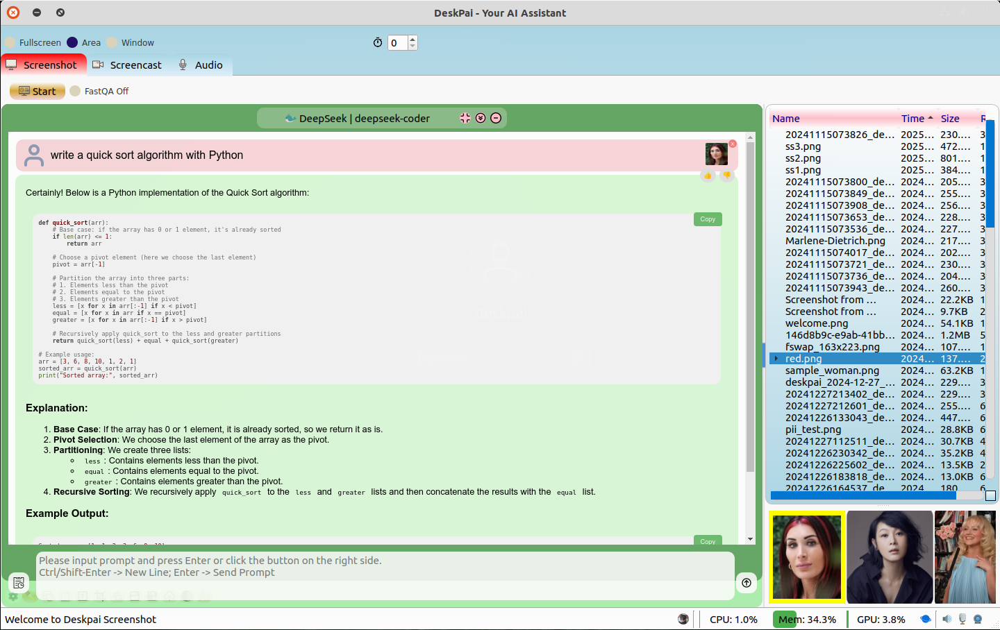
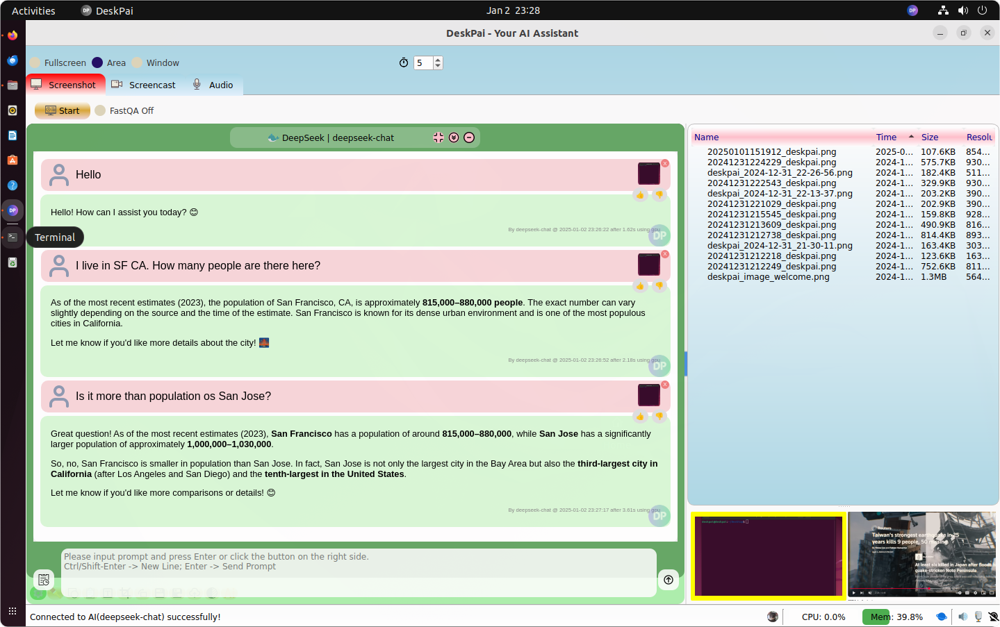

# Deskpai

Deskpai is an AI assistant for screenshot, screencast, audio/webcam recording, and image/audio/video playing and editing. It supports Text/Image/Audio Chat, Ollama integration, face swapping, OCR, PII removal etc.

- OS: Windows and Linux
- Tested in: Windows 10, 11 and Ubuntu 20, 22, 24

## Sponsor and Contact

Buy me a coffee: https://buymeacoffee.com/deskpai

contact: [admin@deskpai.com](mailto:admin@deskpai.com)

## Installation

### Linux

- Download `deskpai.deb` from [here!](https://cms.deskpai.com/download)
- Run `sudo apt install ./deskpai.deb` to install it!

**YouTube video instructions**
- Installation: https://www.youtube.com/watch?v=v_RXqpMA2qk
- Screenshot: https://www.youtube.com/watch?v=Peq5zscL_TA
- Screencast: https://www.youtube.com/watch?v=EU-Xo9dhtMc
- Faceswap: https://www.youtube.com/watch?v=2v6nvZVLdOg
- AI Eraser: https://www.youtube.com/watch?v=8kboDpmPZMo
- OCR: https://www.youtube.com/watch?v=3J3oN-SGc3o
- Audio Recording: https://www.youtube.com/watch?v=YVXrMgaGIF4&t=2s
- Swtich from Wayland to XOrg: https://www.youtube.com/watch?v=4pnxduM9daE

**Support websites**
- HomePage: https://deskpai.com (Please register here: https://cms.deskpai.com/accounts/signup/)
- Media site: https://cms.deskpai.com

### Windows

- Coming soon...

## Screenshot

### Face Swapping

### Video Record/Play/Edit

### Audio Record/Play/Edit

### LLM/Image Chat

#### DeepSeek V3

#### Multiturn Chat

